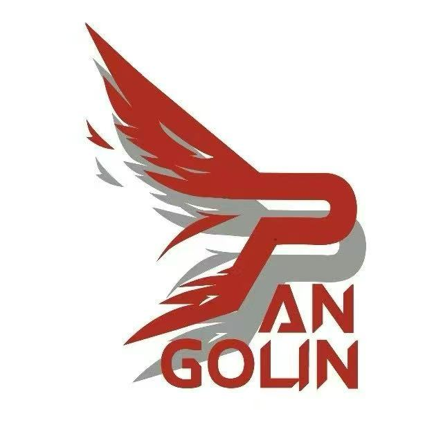

<div align="center">
    
    <h1><i>SPLIB</i></h1>
    <p><b>S</b>ichuan University <b>P</b>angolin <b>Lib</b>rary</p>
    <p>四川大学川山甲战队电控组驱动接口库</p>
    <br>
    <a href="https://github.com/nordic-blessing/splib">
        
    </a>
    <a href="LICENSE">
        
    </a>
</div>

## 📖 项目介绍

**SPLIB** 为四川大学（Sichuan University） 川山甲战队 `Pangolin` 电控组的驱动接口库。旨在将电控常用底层和设备驱动代码进行模块化封装，简化项目构建流程，避免重复造轮子，提高开发效率。同时一定程度上保证工程的规范化，留下让后人看得懂的项目遗产。

本项目基于 STM32 HAL库，包含 **板极驱动** 和 **队内常用设备驱动** 构成，队员可通过修改配置文件 `splib_config.h` 对接口库进行裁剪，仅编译项目中使用的驱动，或按规范自行添加其他模块

---

## 📁 目录结构

| 文件 | 包含内容 |
|:---|:---|
| `Algorithm/` | 常用算法 |
| `Bsp/` | 板级支持文件 |
| `Configer/` | OpenOCD配置文件 |
| `Devices/` | 队内常用设备 |
| `assets/` | 资源文件 |
| `splib_config.h` | 配置文件 |
| `splib.h` | 主头文件 |

---

## ⚙️ 快速开始

- __添加SPLIB到新建项目中__
  - 拷贝 `SPLIB` 项目文件夹
- __修改CMakeLists__
  - 修改CMakeLists，将接口库加入编译目标
  
  ```cmake
  include_directories(${includes}
      Application/
      SPLIB/
  )

  add_definitions(${defines})

  file(GLOB_RECURSE SOURCES ${sources}
      "Application/*.c*"
      "SPLIB/*.c*"
  )
  ```
- __裁剪接口库__
  - 在 `splib_config.h` 中配置项目所使用的驱动
  - 编译

---

## 🚧 TODO

- 功能模块
  - Algorithm
    - [x] PID 控制器
    - [x] 轨迹规划器（sigmod曲线）
    - [ ] 滤波函数
  - Bsp
    - [x] CAN/FDCAN 通信模块
    - [x] UART 串口模块
    - [x] LED 驱动模块
    - [ ] I2C 驱动模块
    - [ ] SPI 驱动模块
  - Devices
    - [ ] 板间 CAN 通讯
    - [ ] Dji M2006 电机
    - [x] Dji M3508 电机
    - [ ] Dji M6020 电机
    - [ ] 大然电机
    - [x] 激光测距模块(L1s)
    - [x] SBUS 遥控器
    - [x] 灵足电机
    - [x] 陶晶驰串口屏 HMI
    - [x] 宇树电机
    - [x] VESC 无刷电调
    - [x] 视觉串口通信 __（需根据与视觉组商定的数据协议自行修改）__
    - [x] VOFA 调试工具
    - [x] 维特 IMU (JY-ME01)
    - [ ] 4-20mA采样数字输出模块
    - [ ] Damiao 电机
  - Configer
    - [x] OpenOCD 配置文件
- 项目测试 
  - [ ] 项目功能性测验
  - [ ] 移植设备适应性测验
- 功能升级
  - [ ] 轨迹规划器（梯形曲线）
  - [ ] 轨迹规划器重规划
- 文档注释
  - [x] README
  - [ ] 代码注释补全

---

## 👨‍💻 作者

- **Icol_Lee** - 四川大学川山甲战队电控组

---

## 🙏 致谢

本项目参考或借鉴了以下开源项目：

| 项目 | 作者/组织 | 协议 | 说明 |
|:---|:---|:---:|:---|
| [SRML](https://github.com/scutrobotlab/srml) | 华南理工大学 SCUT Robotlab | - | 参考了中间件层设计思想与内核可裁剪方案 |
| [UIML](https://gitee.com/tarsgo-embedded/UIML) | 吉林大学 TARS_Go 战队 | GPL-3.0 | 参考了模块化架构设计思路 |

感谢所有开源贡献者！

---

## 📄 许可证

本项目采用 [GPL-3.0](LICENSE) 许可证开源。

---
